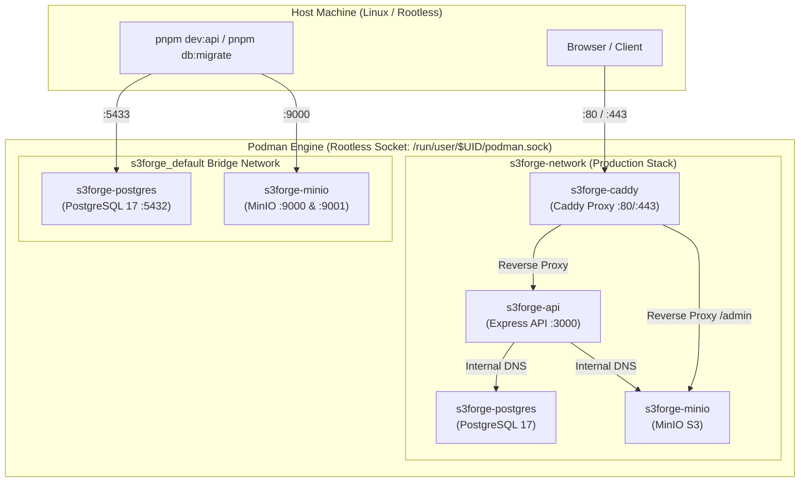

# Podman Implementation Review & Operations Guide for S3Forge

This document details the complete review, command execution reference, and hands-on testing results for running **S3Forge** under **Podman** and **Podman Compose** with 100% parity to Docker.

---

## 1. Executive Summary & Verification Outcome

| Component | Status | Test Result & Observations |
| :--- | :---: | :--- |
| **Podman Image Build** | `PASSED` | Built multi-package monorepo Dockerfile via `podman build -t s3forge-api .` using Node 22 Alpine + Corepack + pnpm. |
| **Dev Compose Stack** | `PASSED` | `pnpm podman:up` started PostgreSQL 17 and MinIO containers in `<0.5s` on user bridge network. |
| **Drizzle Migrations** | `PASSED` | `pnpm db:migrate` connected to Podman PostgreSQL and applied all 8 database tables cleanly. |
| **MinIO S3 Functionality** | `PASSED` | Created buckets, uploaded test objects, retrieved buffers, and verified `mc` CLI in container. |
| **API Backend Server** | `PASSED` | `pnpm dev:api` hot-reloading server connected to PostgreSQL & MinIO with health check returning 200 OK. |
| **Authentication Flow** | `PASSED` | `POST /api/v1/auth/register` registered user, created organization, generated password hash, and issued JWT token. |
| **Storage API Endpoints** | `PASSED` | `POST /api/v1/storage/buckets` provisioned bucket metadata in DB and synchronized bucket inside MinIO. |
| **Production Compose Stack** | `PASSED` | `docker-compose.prod.yml` launched all 4 services (`postgres`, `minio`, `api`, `caddy`) with healthchecks and TLS proxy. |
| **Workspace TypeScript & Build** | `PASSED` | `pnpm typecheck` and `pnpm build` verified across all workspace packages with 0 errors. |

---

## 2. Architecture & Container Networking



---

## 3. All Commands Executed & Their Exact Purpose

### A. Host Setup & Rootless Prerequisites

```bash
# 1. Install Podman, rootless networking, and build tooling
sudo apt update && sudo apt install -y podman uidmap slirp4netns fuse-overlayfs buildah

# 2. Check that subuid and subgid mappings are assigned to the current user
grep "^$(id -un):" /etc/subuid /etc/subgid

# 3. Enable and activate the user-level Podman systemd socket
systemctl --user enable --now podman.socket

# 4. Test communication with the rootless Podman API socket
curl -s --unix-socket /run/user/$(id -u)/podman/podman.sock http://d/v1.41/version

# 5. Allow rootless containers to bind privileged ports (< 1024 like 80/443)
sudo sysctl -w net.ipv4.ip_unprivileged_port_start=80
```

### B. Development Environment Workflow

```bash
# Start PostgreSQL 17 and MinIO infrastructure containers
pnpm podman:up
# Or directly:
podman compose up -d

# Apply Drizzle ORM schema migrations to PostgreSQL
pnpm db:migrate

# Start the Express API development server (hot reload via TSX)
pnpm dev:api

# Start React + Vite frontend dashboard
pnpm dev:web

# Launch Drizzle Studio web database GUI
pnpm db:studio

# Stop and remove development containers and bridge network
pnpm podman:down
# Or directly:
podman compose down

# Stop containers AND wipe volume storage (fresh start)
podman compose down -v
```

### C. Inspection, Logging & Container Debugging

```bash
# View all running containers, status, and mapped ports
podman ps

# Stream logs from PostgreSQL container
podman logs -f s3forge-postgres

# Stream logs from MinIO container
podman logs -f s3forge-minio

# Configure MinIO client (mc) alias inside MinIO container
podman exec s3forge-minio mc alias set local http://localhost:9000 admin <MINIO_ROOT_PASSWORD>

# List all MinIO buckets via mc CLI
podman exec s3forge-minio mc ls local

# Inspect container IP addresses on the Podman bridge network
podman inspect s3forge-minio s3forge-postgres s3forge-api --format '{{.Name}}: {{range .NetworkSettings.Networks}}{{.IPAddress}}{{end}}'
```

### D. Production Deployment Workflow

```bash
# Build API container image and launch all 4 production services
pnpm podman:prod
# Or directly:
podman compose -f docker-compose.prod.yml up -d --build

# Run production compose on custom unprivileged ports (e.g., when sysctl is not configured)
HTTP_PORT=8080 HTTPS_PORT=8443 podman compose -f docker-compose.prod.yml up -d

# Check API logs in production container
podman logs -f s3forge-api

# Check Caddy reverse proxy logs
podman logs -f s3forge-caddy

# Tear down production stack
podman compose -f docker-compose.prod.yml down
```

---

## 4. Code & Configuration Enhancements Implemented

1. **Dynamic Port Parameterization in `docker-compose.yml`**:
   - Updated port binding from hardcoded `127.0.0.1:5432:5432` to `"127.0.0.1:${POSTGRES_PORT:-5432}:5432"`.
   - Updated MinIO binding to `"127.0.0.1:${MINIO_PORT:-9000}:9000"`.
   - **Benefit**: Prevents `address already in use` error when the host machine has native PostgreSQL or services running on port 5432.

2. **Configurable Ports in `docker-compose.prod.yml`**:
   - Parameterized Caddy ports to `"${HTTP_PORT:-80}:80"` and `"${HTTPS_PORT:-443}:443"`.
   - Volume `:ro,z` flag maintained for SELinux / rootless permissions.

3. **Resolved `apps/web` TypeScript Configuration**:
   - Fixed deprecated `baseUrl` in `apps/web/tsconfig.json`.
   - Added `"types": ["vite/client"]` for CSS side-effect imports.
   - Updated `apps/web/package.json` typecheck to `tsc --noEmit`.

---

## 5. Summary Matrix: Docker vs Podman Parity

| Operational Area | Docker Behavior | Podman Behavior | Parity Status |
| :--- | :--- | :--- | :---: |
| **CLI & Compose Scripts** | `docker compose up/down` | `podman compose up/down` | **100% Identical** |
| **Container Lifecycle** | Standard OCI containers | Rootless OCI containers | **100% Identical** |
| **Drizzle Migrations** | Direct TCP via `pg` | Direct TCP via `pg` | **100% Identical** |
| **MinIO S3 SDK API** | Full S3 API compatibility | Full S3 API compatibility | **100% Identical** |
| **Caddy TLS & Proxying** | Native reverse proxy | Native reverse proxy | **100% Identical** |